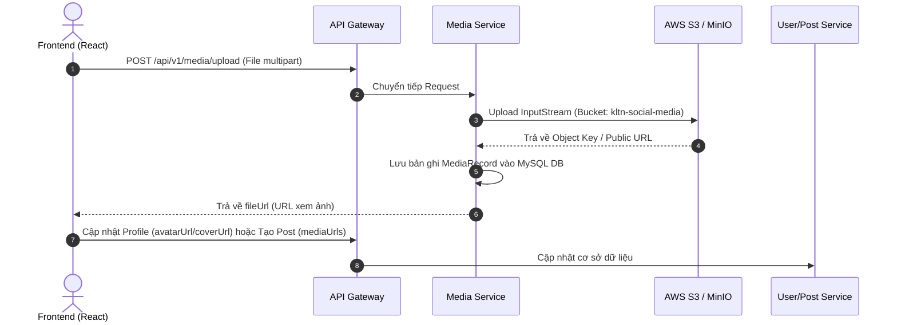

# Kiến Trúc Microservices Backend (Backend Architecture & Services)

Tài liệu chi tiết về hệ thống Microservices Backend của dự án **KLTN Social** xây dựng trên nền tảng **Java Spring Boot 3 & Spring Cloud**.

---

## 🏛️ 1. Danh Sách Các Service & Cổng Port (Service Catalog)

| Tên Microservice | Port | Vai Trò & Chức Năng Chính | Công Nghệ / Storage |
| :--- | :---: | :--- | :--- |
| **`eureka-server`** | `:8761` | Service Discovery & Registry (Đăng ký & định tuyến dịch vụ) | Spring Cloud Netflix Eureka |
| **`api-gateway`** | `:8080` | Cổng API Gateway chính, kiểm tra JWT, Route request đến các Service | Spring Cloud Gateway, JWT |
| **`auth-service`** | `:8081` | Quản lý Đăng ký, Đăng nhập, Cấp JWT Access/Refresh Token, OTP Email, MFA 2FA TOTP | MySQL, Redis, Java Mail, Kafka |
| **`user-service`** | `:8082` | Quản lý Profile cá nhân, Quan hệ Bạn bè, Follow, Tìm kiếm người dùng | MySQL, JPA/Hibernate, Kafka |
| **`post-service`** | `:8083` | Quản lý Bài viết, Cảm xúc (Like/Love/Haha...), Bình luận đa cấp, Hashtags | MySQL, Redis, Kafka |
| **`media-service`** | `:8084` | Xử lý Upload/Delete ảnh, video, tạo Presigned URL S3/MinIO, Hạn mức dung lượng | AWS S3 SDK, CloudFront, MySQL |
| **`chat-service`** | `:8085` | Nhắn tin trực tiếp 1-1, chat nhóm, lịch sử tin nhắn realtime | MongoDB / Redis, WebSocket STOMP |
| **`notification-service`** | `:8086` | Nhận Event qua Kafka & phát thông báo realtime (Push Notification / WebSocket) | Redis, Spring WebSocket, Kafka |
| **`call-service`** | `:8087` | Khởi tạo & điều phối tín hiệu cuộc gọi thoại / video WebRTC (Signaling) | WebRTC Signaling, WebSocket |
| **`feed-service`** | `:8088` | Tổng hợp Newsfeed cá nhân hóa dựa trên bạn bè & tương tác | Redis, Kafka |
| **`moderation-service`**| `:8089` | Kiểm duyệt tự động nội dung bài viết / hình ảnh vi phạm | Kafka, Open AI / Rules |
| **`admin-service`** | `:8090` | Quản trị viên hệ thống (Thống kê người dùng, khóa tài khoản, báo cáo) | MySQL, Spring Security |
| **`ai-service`** | `:8091` | Dịch vụ AI gợi ý bạn bè, đề xuất nội dung bài viết phù hợp | Python / Spring AI Integration |
| **`common-framework`**| N/A | Thư viện mã nguồn chung chứa DTOs, Event Models (`PostDeletedEvent`, `UserRegisteredEvent`...), Core Exception Handling | Java Shared Library Maven |

---

## 🔀 2. Định Tuyến API Gateway (API Gateway Routes)

Tất cả các lệnh gọi từ Frontend đều gửi đến Cổng API Gateway tại `http://localhost:8080` với cấu hình route:

- `/api/v1/auth/**` ➔ `auth-service` (`:8081`)
- `/api/v1/users/**` ➔ `user-service` (`:8082`)
- `/api/v1/posts/**` ➔ `post-service` (`:8083`)
- `/api/v1/media/**` ➔ `media-service` (`:8084`)
- `/api/v1/chat/**` ➔ `chat-service` (`:8085`)
- `/api/v1/notifications/**` ➔ `notification-service` (`:8086`)
- `/ws/**` ➔ WebSocket Endpoint cho Chat & Notification Realtime

---

## 🔄 3. Quy Trình Upload & Quản Lý Media (S3 / Cloud Storage Workflow)

---

## 🛠️ 4. Script Quản Lý Backend

- **`start-all-server.ps1`**: PowerShell script tự động build Maven và khởi chạy tất cả 11 Microservices theo đúng thứ tự phụ thuộc (Eureka ➔ Config ➔ Auth ➔ Services ➔ Gateway).
- **`kill-and-restart.ps1`**: Script dừng toàn bộ các tiến trình Java Spring Boot đang chạy và khởi động lại sạch sẽ.
- **`docker-compose.yaml`**: Định nghĩa container Kafka, Zookeeper, Redis, MySQL DB cho môi trường local.
