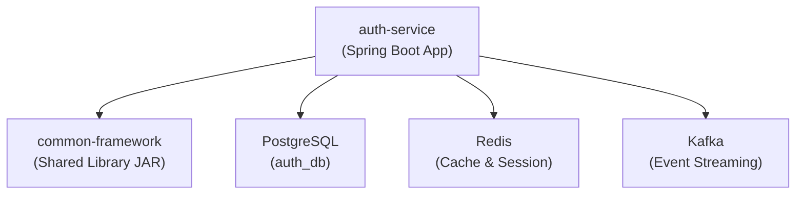

# KLTN_BE — Tổng Quan Dự Án

## 1. Kiến Trúc Tổng Thể

Dự án là hệ thống **microservices** cho khóa luận tốt nghiệp, chạy trên **Spring Boot 4.1.0** + **Java 21**.



### Hai Module Chính

| Module | Vai trò | Packaging |
|--------|---------|-----------|
| [common-framework](file:///e:/KhoaLuan/KLTN_BE/common-framework/pom.xml) | Thư viện dùng chung: Security, Exception, BaseEntity, Mapper, Cache, Filter | JAR (library) |
| [auth-service](file:///e:/KhoaLuan/KLTN_BE/auth-service/pom.xml) | Service xác thực: Register, Login, Logout, Quản lý thiết bị | Executable JAR |

---

## 2. Kiến Trúc Clean Architecture (Vertical Slicing)

Cả hai module đều tuân thủ **Clean Architecture** nghiêm ngặt với 4 tầng:

```
domain/          → Entities thuần (POJO), Enums, Repository interfaces
application/     → Features (Command/Query + Handler + Response), Mappers, DTOs, Exception
infrastructure/  → JPA models, Repository implementations, Security config, Cache
presentation/    → Controllers (REST API)
```

### Quy ước đặt tên theo Vertical Slicing

```
application/features/{feature_name}/commands/{action}/
    ├── {Action}Command.java          ← Input DTO
    ├── {Action}CommandHandler.java    ← Business logic (Service)
    └── {Action}Response.java          ← Output DTO

application/features/{feature_name}/queries/{action}/
    ├── {Action}Query.java
    ├── {Action}QueryHandler.java
    └── {Action}Response.java
```

---

## 3. common-framework — Chi Tiết

### Domain Layer
- [BaseEntity](file:///e:/KhoaLuan/KLTN_BE/common-framework/src/main/java/iuh/fit/commonframework/domain/entity/BaseEntity.java): UUID PK (time-based), audit fields (`createdAt`, `updatedAt`, `createdBy`, `updatedBy`), soft delete (`deleted`)

### Application Layer
- [ApiResponse\<T\>](file:///e:/KhoaLuan/KLTN_BE/common-framework/src/main/java/iuh/fit/commonframework/application/dto/ApiResponse.java): Response wrapper chuẩn (`code`, `message`, `data`, `timestamp`)
- [ErrorCode](file:///e:/KhoaLuan/KLTN_BE/common-framework/src/main/java/iuh/fit/commonframework/application/exception/ErrorCode.java): Enum các mã lỗi (500, 400, 401, 403, 404) kèm HttpStatus
- [BusinessException](file:///e:/KhoaLuan/KLTN_BE/common-framework/src/main/java/iuh/fit/commonframework/application/exception/BusinessException.java): Runtime exception chứa ErrorCode
- [GlobalExceptionHandler](file:///e:/KhoaLuan/KLTN_BE/common-framework/src/main/java/iuh/fit/commonframework/application/exception/GlobalExceptionHandler.java): `@ControllerAdvice` xử lý `Exception`, `BusinessException`, `AccessDeniedException`, `ConstraintViolationException`, `MethodArgumentNotValidException`
- [BaseMapper\<E, D\>](file:///e:/KhoaLuan/KLTN_BE/common-framework/src/main/java/iuh/fit/commonframework/application/mapper/BaseMapper.java): Interface MapStruct cơ sở (`toEntity`, `toDto`, `updateEntityFromDto`)

### Infrastructure Layer
- [SecurityConfig](file:///e:/KhoaLuan/KLTN_BE/common-framework/src/main/java/iuh/fit/commonframework/infrastructure/security/SecurityConfig.java): JWT RS256 qua `oauth2ResourceServer`, public endpoints cho `/api/v1/auth/**`, `/api/v1/public/**`, Swagger
- [JwtUtil](file:///e:/KhoaLuan/KLTN_BE/common-framework/src/main/java/iuh/fit/commonframework/infrastructure/security/JwtUtil.java): Tiện ích lấy userId/claim từ `SecurityContext`
- [CacheConfig](file:///e:/KhoaLuan/KLTN_BE/common-framework/src/main/java/iuh/fit/commonframework/infrastructure/cache/CacheConfig.java): Redis cache với JSON serialization, TTL có thể cấu hình
- [BaseFilter](file:///e:/KhoaLuan/KLTN_BE/common-framework/src/main/java/iuh/fit/commonframework/infrastructure/filter/BaseFilter.java): DTO phân trang/sắp xếp/lọc (`page`, `size`, `sortBy`, `sortDirection`, `filters`)

---

## 4. auth-service — Chi Tiết

### Domain Layer
- [User](file:///e:/KhoaLuan/KLTN_BE/auth-service/src/main/java/iuh/fit/authservice/domain/entities/User.java): POJO thuần — `email`, `password`, `fullName`, `status`, `roles`, `mfaEnabled`
- [Device](file:///e:/KhoaLuan/KLTN_BE/auth-service/src/main/java/iuh/fit/authservice/domain/entities/Device.java): POJO thuần — `deviceFingerprint`, `deviceName`, `ipAddress`, `location`, `refreshTokenHash`, `status`
- [UserStatus](file:///e:/KhoaLuan/KLTN_BE/auth-service/src/main/java/iuh/fit/authservice/domain/enums/UserStatus.java): `ACTIVE`, `INACTIVE`, `LOCKED`, `BANNED`
- [DeviceStatus](file:///e:/KhoaLuan/KLTN_BE/auth-service/src/main/java/iuh/fit/authservice/domain/enums/DeviceStatus.java): `ACTIVE`, `REVOKED`, `EXPIRED`
- [UserRepository](file:///e:/KhoaLuan/KLTN_BE/auth-service/src/main/java/iuh/fit/authservice/domain/repository/UserRepository.java): `findByEmail`, `existsByEmail`, `save`
- [DeviceRepository](file:///e:/KhoaLuan/KLTN_BE/auth-service/src/main/java/iuh/fit/authservice/domain/repository/DeviceRepository.java): `findById`, `findByUserId`, `findByUserIdAndDeviceFingerprint`, `save`

### Application Layer — Features

| Feature | Type | Files |
|---------|------|-------|
| **Register User** | Command | `RegisterUserCommand`, `RegisterUserCommandHandler`, `RegisterUserResponse` |
| **Login User** | Command | `LoginUserCommand`, `LoginUserCommandHandler`, `LoginUserResponse`, `UserResponse` |
| **Logout User** | Command | `LogoutUserCommand`, `LogoutUserCommandHandler` |
| **Get User Devices** | Query | `GetUserDevicesQuery`, `GetUserDevicesQueryHandler`, `GetUserDevicesResponse`, `DeviceResponse` |
| **Revoke Device** | Command | `RevokeDeviceCommand`, `RevokeDeviceCommandHandler` |

### Application Layer — Mappers
- [RegisterUserMapper](file:///e:/KhoaLuan/KLTN_BE/auth-service/src/main/java/iuh/fit/authservice/application/mapper/RegisterUserMapper.java): Command → Domain Entity, Domain → Response
- [LoginUserMapper](file:///e:/KhoaLuan/KLTN_BE/auth-service/src/main/java/iuh/fit/authservice/application/mapper/LoginUserMapper.java): User → UserResponse, update Device from login data
- [GetUserDevicesMapper](file:///e:/KhoaLuan/KLTN_BE/auth-service/src/main/java/iuh/fit/authservice/application/mapper/GetUserDevicesMapper.java): Device list → DeviceResponse list

### Infrastructure Layer
- **JPA Models**: [UserDbModel](file:///e:/KhoaLuan/KLTN_BE/auth-service/src/main/java/iuh/fit/authservice/infrastructure/persistence/models/UserDbModel.java), [DeviceDbModel](file:///e:/KhoaLuan/KLTN_BE/auth-service/src/main/java/iuh/fit/authservice/infrastructure/persistence/models/DeviceDbModel.java) — kế thừa `BaseEntity`, có validation annotations đọc message từ `ValidationMessages.properties`
- **Model Mappers**: `UserModelMapper`, `DeviceModelMapper` — map giữa Domain entity ↔ JPA model
- **Repository Impls**: `UserRepositoryImpl`, `DeviceRepositoryImpl` — adapter pattern từ Domain interface → JPA
- **Security**: [JwtTokenProvider](file:///e:/KhoaLuan/KLTN_BE/auth-service/src/main/java/iuh/fit/authservice/infrastructure/security/JwtTokenProvider.java) (sinh JWT RS256), [SecurityBeansConfig](file:///e:/KhoaLuan/KLTN_BE/auth-service/src/main/java/iuh/fit/authservice/infrastructure/security/SecurityBeansConfig.java) (`PasswordEncoder`, `JwtEncoder`), [TokenProvider](file:///e:/KhoaLuan/KLTN_BE/auth-service/src/main/java/iuh/fit/authservice/infrastructure/security/TokenProvider.java) interface
- **OpenAPI**: [OpenApiConfig](file:///e:/KhoaLuan/KLTN_BE/auth-service/src/main/java/iuh/fit/authservice/infrastructure/config/OpenApiConfig.java) — Swagger JWT Bearer scheme

### Presentation Layer
- [AuthController](file:///e:/KhoaLuan/KLTN_BE/auth-service/src/main/java/iuh/fit/authservice/presentation/controller/AuthController.java): `/api/v1/auth` — `POST /register`, `POST /login`, `POST /logout`
- [DeviceController](file:///e:/KhoaLuan/KLTN_BE/auth-service/src/main/java/iuh/fit/authservice/presentation/controller/DeviceController.java): `/api/v1/devices` — `GET /` (list), `DELETE /{deviceId}` (revoke)

---

## 5. Quy Ước & Pattern Quan Trọng

| Quy ước | Mô tả |
|---------|-------|
| **Lombok** | `@FieldDefaults(level = AccessLevel.PRIVATE)` trên mọi class, `@RequiredArgsConstructor` cho DI |
| **Validation** | Jakarta Validation + message key từ [ValidationMessages.properties](file:///e:/KhoaLuan/KLTN_BE/auth-service/src/main/resources/ValidationMessages.properties) (VD: `{user.email.required}`) |
| **Mapping 3 lớp** | Domain Entity ↔ JPA Model (ModelMapper) ↔ Request/Response DTO (Feature Mapper) |
| **No nested classes** | Mỗi Command, Response, Handler nằm trong file riêng biệt |
| **Soft delete** | BaseEntity có field `deleted`, không xóa cứng |
| **JWT** | RSA256 (public/private key trong `application.yaml`), Access + Refresh token |
| **Swagger** | springdoc-openapi 2.8.6, `@Tag` + `@Operation` trên controllers |

## 6. Infrastructure Stack

| Component | Technology | Config |
|-----------|-----------|--------|
| Database | PostgreSQL 18.4 | `jdbc:postgresql://localhost:5432/auth_db` |
| Cache | Redis (Alpine) | Port 6379, Redis Insight at 5540 |
| Message Broker | Apache Kafka 3.7.0 | Port 9092, Kafka UI at 8089 |
| Logging | Logback + Spring Boot rolling file | `logs/auth-service-{date}.log`, max 10MB, 30 ngày |

## 7. Phiên Bản Dependencies

| Library | Version |
|---------|---------|
| Spring Boot | 4.1.0 |
| Java | 21 |
| Lombok | 1.18.38 |
| MapStruct | 1.5.5.Final |
| springdoc-openapi | 2.8.6 |
| lombok-mapstruct-binding | 0.2.0 |
